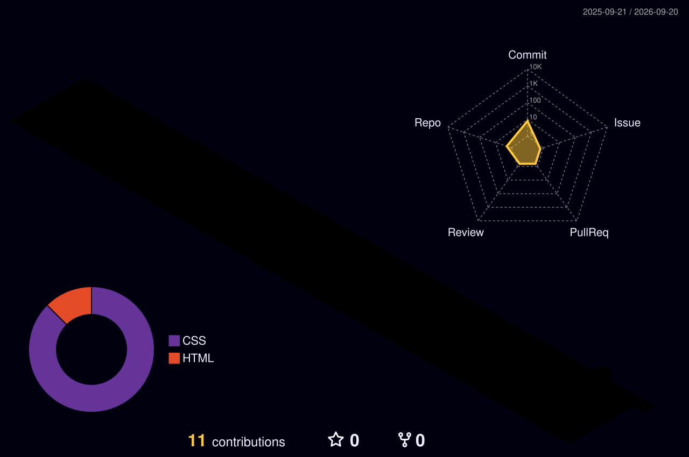

  

<h3 align="center">IT Support Analyst · Infrastructure · Automation</h3>

  📍 Curitiba - PR · 📧 kauan.bernardes.machado@gmail.com · <a href="https://www.linkedin.com/in/kauan-vitor-machado-da-silva-11b74a22b/">LinkedIn</a>

---

## 👋 Sobre Mim

Analista de Suporte com experiência em **suporte técnico**, **infraestrutura**, **troubleshooting** e **atendimento a usuários**. Atuo com **Windows**, **Linux**, **redes**, **Service Desk**, **GLPI** e conceitos de **ITIL**, buscando sempre melhorar processos e automatizar tarefas do dia a dia.

Atualmente, estou expandindo meus conhecimentos em desenvolvimento e construindo o **Project-Helpdesk**, um sistema ITSM desenvolvido do zero, do front-end ao back-end.

---

---

## 🛠️ Skills

  

  

  IT Support · Hardware · Software · Troubleshooting · User Support · Networks · Service Desk · GLPI · ITIL · Scripts · Workflow Automation · Process Optimization

---

## 🌱 Estudando Atualmente

- **JavaScript**, DOM, Arrays, Objects, Functions e Logic
- **Node.js**, APIs e desenvolvimento back-end
- **PHP** e **MySQL**
- **Git** e **GitHub**
- Desenvolvimento e evolução do **Project-Helpdesk**

---

## 💼 Experiência

**Técnico de Suporte N1** — *(2025 – 2026)*  
**Auxiliar de TI** — *(2025)*  
**Estagiário de TI** — *(2022 – 2023)*

---

## 🚀 Projeto em Destaque

### Project-Helpdesk

Sistema **ITSM desenvolvido do zero**, com foco em suporte técnico, gestão de chamados e melhoria de processos. O projeto está sendo construído desde o **front-end até o back-end**, como parte da minha evolução em desenvolvimento de software e automação.

---

  Feito com 💙 e ☕ por Kauan Vitor

